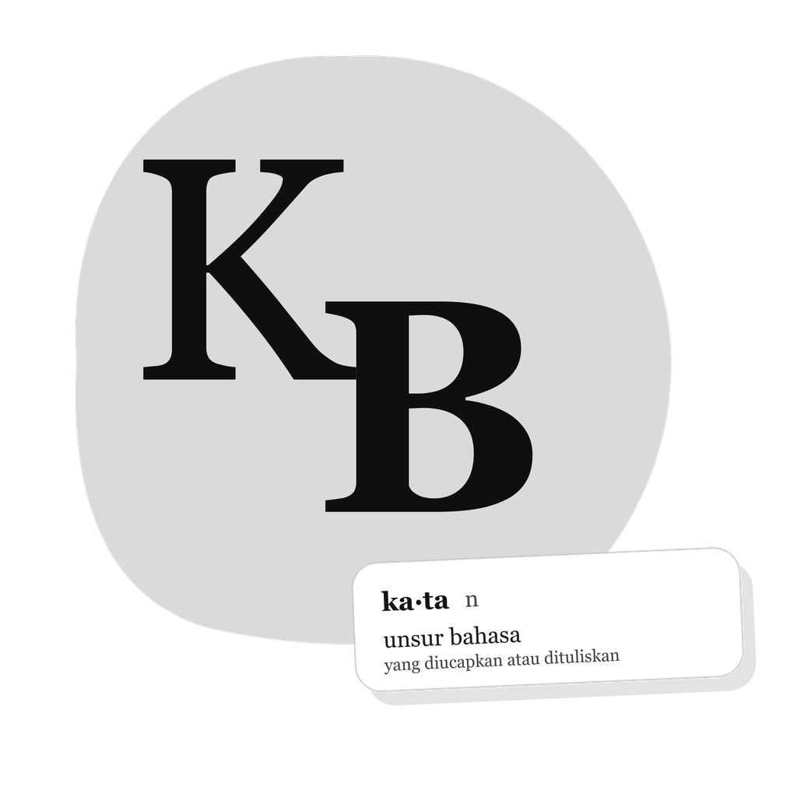

<p align="center">
  
</p>

<h1 align="center">KBBI SQL Database</h1>

<p align="center">
  Basadata (Database) Kamus Besar Bahasa Indonesia (KBBI) yang menyediakan ribuan entri kata lengkap dengan data pendukung seperti sinonim, antonim, dan kata baku/nonbaku untuk kebutuhan pengembangan aplikasi.
</p>

<p align="center">
  <a href="#data-explorer">Data Explorer</a> •
  <a href="#ikhtisar-direktori-data">Ikhtisar Data</a> •
  <a href="#integrasi-api">Integrasi API</a> •
  <a href="#contoh-aplikasi">Contoh Aplikasi</a>
</p>

---

## Data Explorer

Antarmuka berbasis Svelte tersedia di direktori [`ui`](ui/) untuk menjelajahi
kamus utama, kata baku dan nonbaku, sinonim, serta antonim secara interaktif.
Data kamus yang besar diproses menjadi indeks pencarian dan shard per huruf
agar tidak membebani pemuatan awal.

```bash
cd ui
npm install
npm run dev
```

Gunakan `npm run build` untuk menyiapkan data dan membuat build produksi.
Workflow `.github/workflows/deploy-pages.yml` akan menerbitkan UI ke GitHub
Pages setiap kali branch `main` diperbarui. Aktifkan **Pages → Source → GitHub
Actions** pada pengaturan repositori.

## Ringkasan Data

Repositori ini menyimpan total data bahasa Indonesia dengan rincian sebagai berikut:

- **Kamus Utama (Edisi IV):** `115.978` kata
- **Kata Baku & Nonbaku:** `2.847` pasangan kata
- **Sinonim (Padanan Kata):** `4.625` entri data
- **Antonim (Lawan Kata):** `550` entri data

---

## Ikhtisar Direktori Data

Seluruh data dikelompokkan ke dalam direktori terstruktur berdasarkan fungsinya masing-masing:

### [1. KBBI Edisi IV (Kamus)](edisi-IV/README.md)

Berisi pangkalan data utama Kamus Besar Bahasa Indonesia Edisi IV. Menyediakan kosakata beserta artinya dalam berbagai format data siap pakai (SQL, CSV, JSON, HTML, XML, PHP Array, dan DbUnit).

### [2. Baku & Nonbaku](baku-nonbaku/README.md)

Menyediakan daftar perbandingan kata baku dan tidak baku untuk validasi ejaan berdasarkan standar KBBI.

### [3. Sinonim (Padanan Kata)](sinonim/README.md)

Berisi kumpulan relasi sinonim antarkata dalam bahasa Indonesia.

### [4. Antonim (Lawan Kata)](antonim/README.md)

Berisi hubungan oposisi makna atau lawan kata dalam bahasa Indonesia.

### [5. Data Mentah (Raw Data)](data-raw/)

Menyimpan berkas SQL mentah hasil partisi database utama untuk memudahkan proses impor data berkapasitas besar.

---

## Integrasi API

Apabila data lokal yang tersedia di repositori ini kurang lengkap, Anda dapat mengintegrasikannya dengan layanan eksternal berikut:

- **[API KBBI PHP CodeIgniter 4](https://github.com/dyazincahya/API-KBBI-PHP-CodeIgniter-4)** — Mengambil data dinamis yang bersumber langsung dari portal resmi [KBBI Daring Kemendikdasmen](https://kbbi.kemendikdasmen.go.id/).

---

## Contoh Aplikasi

Penerapan basis data ini dapat dilihat langsung pada aplikasi Android berikut:

- **MyKBBI:** [Unduh di Google Play Store](https://play.google.com/store/apps/details?id=com.kang.cahya.apps.mykbbi)

---

## Sumber Data

Repositori ini merupakan kurasi dari berbagai sumber data bahasa Indonesia yang tersedia di internet, khususnya GitHub. Namun sebagian data ada yang dibuat menggunakan AI (Artificial Intelligence).

1. **[Ican Bachors (KBBI.sql)](https://github.com/bachors/KBBI.sql)** — Penyedia data repositori dasar.
2. **[aryakdaniswara (kbbi-v6-full-csv)](https://github.com/aryakdaniswara/kbbi-v6-full-csv)** — Penyedia data repositori dasar.
3. **[aryakdaniswara (kbbi-v6-categories)](https://github.com/aryakdaniswara/kbbi-v6-categories)** — Penyedia data repositori dasar.
4. **[aryakdaniswara (kbbi-v6-wordlist)](https://github.com/aryakdaniswara/kbbi-v6-wordlist)** — Penyedia data repositori dasar.
5. **[aryakdaniswara (kbbi-dataset-kbbi-v)](https://github.com/aryakdaniswara/kbbi-dataset-kbbi-v)** — Penyedia data repositori dasar.
6. **[raf555 (KBBI-api)](https://github.com/raf555/kbbi-api)** — Penyedia data repositori dasar.
7. **Baku & Nonbaku** — Dibuat menggunakan model kecerdasan buatan GPT-5.6 Sol.
8. **Sinonim** — Dibuat menggunakan model kecerdasan buatan GPT-5.6 Sol.
9. **Antonim** — Dibuat menggunakan model kecerdasan buatan GPT-5.6 Sol.

---

> [!WARNING]
>
> ### Hak Cipta dan Kepemilikan Data (Copyright and Data Ownership)
>
> Seluruh data di dalam kamus ini dimiliki sepenuhnya oleh **Badan Pengembangan dan Pembinaan Bahasa, Kementerian Pendidikan Dasar dan Menengah Republik Indonesia**.
>
> Penggunaan dataset ini untuk kebutuhan komersial sangat dilarang dan tunduk pada ketentuan hukum pidana berdasarkan **Undang-Undang Republik Indonesia Nomor 28 Tahun 2014 tentang Hak Cipta**.

---

<p align="center">
  Dikelola oleh <strong><a href="https://kang-cahya.com">Kang Cahya</a></strong>
</p>
